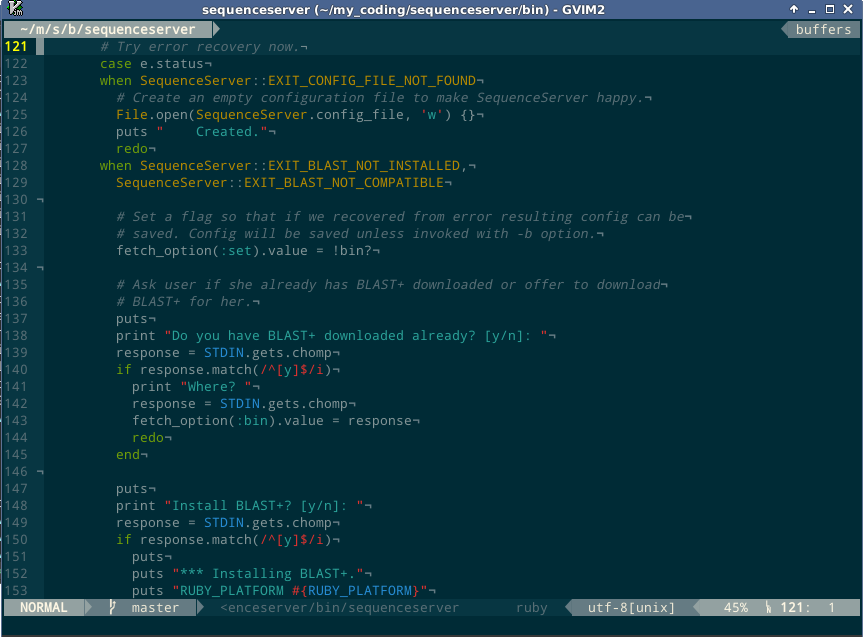

I have completely revamped my older Vim configuration and hence I had to do a
forced push. If you were using previous repository, you may wish to have look at
this newer one. I will briefly list the changes here.

Changes
-------
* `.git` tree structure was disrupted because of my experiments with git. Now all
the plugins are imported as submodules to ensure that you get the latest and
stable versions.
* Plugins were selected carefully and useful options were set.
* Updated Vim to latest version 7.4.227.
* Revamped .vimrc, removed redundant entries, streamlined plugin options.
* Solarized to be used as default theme.

### Update on 29 June 2014
I have pushed another branch `minimal` which removes many of plugins that require more
than a little effort on the part of user who is new to vim. The branch has just
enough set of plugins to get started with a nicer interface and accordingly set
settings. Hence you have two choices, 

1. Clone the frequently updated, feature rich `master` using the instructions
   below (be sure to checkout the important note) **OR**

2. Clone the `minimal` using the same instructions and get going. No further
   tweaking should be required. Feel free to add plugins and other settings
   of your own choice.

Installation
------------
If you want to fetch `master` branch :

    git clone -b master --single-branch https://github.com/vivekiitkgp/Dotfiles-vim.git ~/.vim
or if you want to fetch 'minimal' branch:

    git clone -b minimal --single-branch https://github.com/vivekiitkgp/Dotfiles-vim.git ~/.vim
The common instructions then follow -

    cd .vim
    git submodule init
    git submodule update
    git submodule foreach git submodule init
    git submodule foreach git submodule update

*Symlinks*

    ln -s ~/.vim/.vimrc ~/.vimrc
    ln -s ~/.vim/.gvimrc ~/.gvimrc

Although I do not plan to add anything new at the moment, you can see frequent
changes in the .(g)vimrc file.

Important
---------
### (For `master` branch)
This Vim configuration uses two plugins and a program  all of which require a
little more configuration on behalf of user.
* `YouCompleteMe` plugin ( a code completion engine for vim ) requires a
compiled component. After completing steps mentioned above, please refer to
[this page] (https://github.com/Valloric/YouCompleteMe#full-installation-guide)
and follow the instructions accordingly.
* If you see strange characters in status line or improper appearance then
please install powerline fonts from
[here](https://github.com/Lokaltog/powerline-fonts). I have already included
other measures to fix this problem in the `.vimrc`. Open an issue if the problem
isn't fixed.

If you do not want to use these plugins then remove these submodules
from your `git` repository and comment/remove the specific sections from your
`.(g)vimrc`. Plugin specific settings are properly commented and kept in a
single place.

However, in order to save all this trouble, I have created another `minimal`
branch where you can get all the necessary settings without these plugins. See
the instructions below. Please note that `minimal` is less feature rich, as the
name suggests.

### (For `minimal` branch)
* If you see strange characters in status line or improper appearance then
please install powerline fonts from
[here](https://github.com/Lokaltog/powerline-fonts). I have already included
other measures to fix this problem in the `.vimrc`. Open an issue if the problem
isn't fixed.

Screenshot
----------
The following is a screenshot of vim in terminal (using tmux) with Python Koans file open.

Feedback
--------
Feel free to drop fork, modify or suggest any changes you like.
